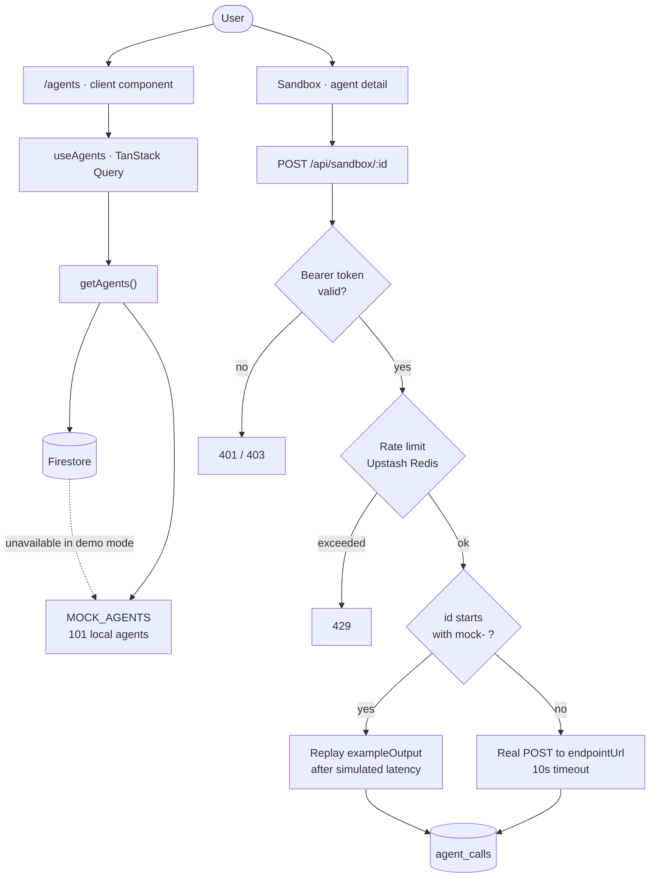

<div align="center">

# AgentHub

**Discover, test, and integrate AI agents from one platform.**

A marketplace and testing surface for production-ready AI agents — browse by capability, validate against a live sandbox before you commit, chain several into a workflow, and scan any GitHub repository to find where an agent would actually save your team time.

[](https://nextjs.org)
[](https://react.dev)
[](https://typescriptlang.org)
[](https://tailwindcss.com)
[](https://firebase.google.com)

</div>

---

## Contents

- [Quick start](#quick-start) · [Demo mode](#demo-mode) · [The catalog](#the-catalog)
- [How it works](#how-it-works) · [Features](#features) · [Tech stack](#tech-stack)
- [Configuration](#configuration) · [Project structure](#project-structure) · [API reference](#api-reference)
- [Data model](#data-model) · [Authentication](#authentication) · [Deployment](#deployment)
- [Known limitations](#known-limitations) · [Contributing](#contributing)

---

## Quick start

**Prerequisites:** Node.js 20+ (developed on 22.19), npm 10+.

```bash
git clone https://github.com/parasb184-web/AgentHub.git
cd AgentHub
npm install
npm run dev
```

Open <http://localhost:3000>. **No configuration required** — see below.

---

## Demo mode

**The app runs with zero credentials.** With no `.env.local`, AgentHub starts in demo mode rather than crashing or showing empty pages.

| Works in demo mode | Needs credentials |
| --- | --- |
| Full 101-agent catalog | GitHub sign-in |
| Filtering, sorting, semantic search | `/dashboard` and `/publish` |
| Agent detail pages and sandbox previews | API key issuance |
| Activity feed (served locally) | Live sandbox execution |
| Repo scanner UI | Persisted scans and chains |

This is deliberate: `isFirebaseConfigured` in [`src/lib/firebase.ts`](./src/lib/firebase.ts) gates Auth initialization, so the SDK never attempts a network call with a placeholder key. Routes that would otherwise block on offline Firestore writes short-circuit to local data instead.

To enable everything, copy the template and fill it in:

```bash
cp .env.example .env.local
```

---

## The catalog

The marketplace ships with **101 agents** across 13 domains — engineering, QA, DevOps, security, data, marketing, support, finance, legal, healthcare, education, design, and operations — yielding 40 capability tags and 19 languages to filter on.

| Group | Count | Source | Sandbox behavior |
| --- | --- | --- | --- |
| Hand-written | 16 | [`dummyData.ts`](./src/lib/dummyData.ts) | Replays `exampleOutput` |
| Generated | 80 | [`generatedAgents.ts`](./src/lib/generatedAgents.ts) | Replays `exampleOutput` |
| **Live** | **5** | [`generatedAgents.ts`](./src/lib/generatedAgents.ts) | **Real HTTP POST** |

### Live agents

Five agents point at public, keyless JSON APIs, so running them in the sandbox performs a genuine network round trip and returns a real response — real latency, real payload, real errors.

| Agent | Endpoint |
| --- | --- |
| Request Echo Inspector | `httpbin.org/post` |
| Webhook Payload Validator | `postman-echo.com/post` |
| Object Store Writer | `api.restful-api.dev/objects` |
| Draft Post Recorder | `dummyjson.com/posts/add` |
| Catalog Item Publisher | `fakestoreapi.com/products` |

These are integration and debugging utilities rather than AI models — useful for verifying that a chain's wiring works end to end before you point it at a paid endpoint.

The generated agents derive their stats (latency, cost, trust, rating) from a hash of their slug, so values are varied but **deterministic** — no hydration mismatch, and sorting is stable across reloads.

---

## How it works



The key branch is at the bottom: `isMockAgent()` decides whether the sandbox simulates a response or actually calls out. An agent is treated as a mock if its id starts with `mock-` or its endpoint points at `api.agenthub.dev` / `example.com`. Everything else gets a real request.

Data reads follow the same fall-back shape — `getAgents()` merges Firestore results with the local catalog and returns the local catalog alone when Firestore is unreachable, which is what keeps demo mode useful rather than empty.

---

## Features

| Feature | Route | What it does |
| --- | --- | --- |
| **Agent directory** | `/agents` | Browse and filter by capability tag, language, latency, and cost. Each agent carries a trust score, rating, and uptime figure. |
| **Live sandbox** | `/agents/[id]` | Fire a request at an agent's endpoint and inspect the response, latency, and errors before integrating. |
| **Repo scanner** | `/scan` | Point it at a GitHub repo. Reads languages, open issues, recent commits, and README, then proposes agent opportunities with estimated time saved. |
| **Chain studio** | `/chains` | Compose multi-agent workflows on a React Flow canvas, with a schema mapper for wiring one agent's output into the next one's input. |
| **Gap detection** | `/api/gap-detect` | Embeds a repo's languages and tags, finds the nearest already-scanned repos, and surfaces agent categories you are missing. |
| **Semantic search** | `/api/search` | Vector search over agent embeddings, with a synonym layer so "ppt" finds presentation agents. |
| **Publishing flow** | `/publish` | Four-step form to list an agent: basics, technical schema, pricing, and worked examples. |
| **Developer dashboard** | `/dashboard` | Issue and revoke API keys, and view call analytics for agents you own. |
| **Repo stack pages** | `/stack/[owner]/[repo]` | Shareable public page of the agent stack chosen for a repo, with an embeddable SVG badge. |

---

## Tech stack

| Layer | Choice |
| --- | --- |
| Framework | Next.js 16.2 (App Router, Turbopack), React 19.2 |
| Language | TypeScript 5 |
| Styling | Tailwind CSS 4, shadcn/ui, Base UI, Lucide |
| Auth & data | Firebase Auth (GitHub OAuth), Cloud Firestore |
| Vector search | Upstash Vector |
| Embeddings | `@xenova/transformers` (`all-MiniLM-L6-v2`) — runs locally, **no embedding API needed** |
| Rate limiting | Upstash Redis via `@upstash/ratelimit` |
| AI | Anthropic Claude `claude-opus-5` with adaptive thinking (scan analysis, search reasoning), Google Gemini `gemini-2.0-flash` (news digest) |
| State & fetching | Zustand, TanStack Query, nuqs |
| Canvas & charts | React Flow, Recharts, Monaco Editor, Shiki |

---

## Configuration

```bash
cp .env.example .env.local
```

| Variable | Required for | Without it |
| --- | --- | --- |
| `NEXT_PUBLIC_FIREBASE_*` (×6) | Auth, all Firestore data | Demo mode: sign-in disabled, catalog served locally |
| `ANTHROPIC_API_KEY` | Repo scan analysis, search reasoning | Claude calls fail; fallback heuristics used |
| `GEMINI_API_KEY` | `/api/ai-news` digest | News section returns empty |
| `GITHUB_TOKEN` | `/scan`, `/api/github-scan` | Unauthenticated GitHub limit (60 req/hr vs 5000) |
| `UPSTASH_VECTOR_*` | Semantic search, gap detection | Vector queries fail |
| `UPSTASH_REDIS_*` | Sandbox rate limiting | Rate limiting is inert |

> [!IMPORTANT]
> `NEXT_PUBLIC_*` values are exposed to the browser — that is expected for Firebase web config, where access is controlled by [`firestore.rules`](./firestore.rules) rather than secrecy. Everything else is server-only; keep it in Secret Manager in production. `.gitignore` excludes all `.env*` files except `.env.example`.

### Scripts

```bash
npm run dev     # dev server (Turbopack) on :3000
npm run build   # production build
npm start       # serve the production build
npm run lint    # eslint
```

`scripts/preWarm.ts` is a one-off seeder that populates the activity feed and pre-scans a few well-known repositories.

---

## Project structure

```
src/
├── app/
│   ├── api/               # 15 route handlers
│   ├── agents/            # directory + detail with sandbox
│   ├── chains/            # multi-agent workflow builder
│   ├── scan/              # GitHub repo scanner
│   ├── stack/             # public per-repo agent stack pages
│   ├── dashboard/         # API keys + analytics   (auth required)
│   ├── publish/           # agent submission flow  (auth required)
│   └── login/
├── components/
│   ├── agenthub/          # landing page sections
│   ├── ui/                # shadcn/ui primitives
│   └── PublishForm/       # four-step publishing wizard
├── lib/
│   ├── firebase.ts        # app/auth/Firestore init + isFirebaseConfigured
│   ├── firestore.ts       # typed data access with local fallback
│   ├── dummyData.ts       # 16 hand-written agents + catalog assembly
│   ├── generatedAgents.ts # 5 live + 80 generated agents
│   ├── claudeClient.ts    # Anthropic client + Firestore response cache
│   ├── geminiClient.ts    # Gemini client + cache
│   ├── githubClient.ts    # repo metadata, languages, issues, commits
│   ├── vectorSearch.ts    # Upstash Vector queries
│   ├── embeddings.ts      # local transformer embeddings
│   └── types.ts           # shared domain types
├── hooks/
└── proxy.ts               # route guard (Next 16's middleware)
```

---

## API reference

| Route | Method | Purpose |
| --- | --- | --- |
| `/api/agents` | `GET` `POST` | List and create agents |
| `/api/agents/[id]` | `GET` | Read a single agent |
| `/api/chains` | `GET` `POST` | List and create workflows |
| `/api/chains/[id]` | `GET` `POST` | Read and update one workflow |
| `/api/sandbox/[id]` | `POST` | Execute an agent — **requires `Authorization: Bearer <key>`**, rate limited, 10s timeout |
| `/api/keys` | `GET` `POST` `PUT` | Issue, list, and revoke API keys (SHA-256 hashed at rest) |
| `/api/search` | `POST` | Semantic agent search |
| `/api/github-scan` | `POST` | Analyze a repository |
| `/api/gap-detect` | `POST` | Find missing agent categories |
| `/api/upsert-vector` | `POST` | Index an agent into Upstash Vector |
| `/api/trending-agents` | `GET` | Trending list for the homepage |
| `/api/activity` | `GET` `POST` | Activity feed — serves a local feed in demo mode; `POST` returns 503 there |
| `/api/ai-news` | `GET` | Gemini-generated AI news digest |
| `/api/badge/[owner]/[repo]` | `GET` | SVG badge showing a repo's agent count |
| `/api/og` | `GET` | Dynamic Open Graph images |

---

## Data model

Firestore collections:

`agents` · `agent_calls` · `agent_reviews` · `api_keys` · `chains` · `activity_feed` · `repo_scans` · `repo_stacks` · `copyright_claims`

Core types live in [`src/lib/types.ts`](./src/lib/types.ts). Security rules are in [`firestore.rules`](./firestore.rules) — agents and reviews are publicly readable, writes require authentication, and updates are restricted to the owning user.

---

## Authentication

Two independent mechanisms:

**Sign-in** — Firebase GitHub OAuth. [`src/proxy.ts`](./src/proxy.ts) guards `/dashboard` and `/publish`, redirecting unauthenticated visitors to `/login` with a `redirect` parameter so they return to where they started.

**Sandbox execution** — API keys minted in the dashboard and sent as a Bearer token. Only the SHA-256 hash and a short display prefix are stored, so a key cannot be recovered after it is shown once.

---

## Deployment

Configuration ships for three targets.

<details>
<summary><strong>Firebase App Hosting</strong> — <code>apphosting.yaml</code></summary>

1. Create or open a Firebase project on the Blaze plan.
2. In the Firebase console, open **App Hosting** and create a backend.
3. Connect this repository and deploy the `main` branch from the repo root.
4. Under **Environment**, add the plain-text values: all six `NEXT_PUBLIC_FIREBASE_*`, plus `UPSTASH_VECTOR_REST_URL` and `UPSTASH_REDIS_REST_URL`.
5. Create these Secret Manager entries to match `apphosting.yaml`: `anthropic-api-key`, `upstash-vector-rest-token`, `upstash-redis-rest-token`.
6. Roll out the backend.

`runConfig.maxInstances` is set to 5.

</details>

<details>
<summary><strong>Vercel</strong> — <code>vercel.json</code></summary>

Import the repository and add every variable from the table above. A daily cron hits `/api/activity` at midnight UTC to keep the feed fresh.

</details>

<details>
<summary><strong>Render</strong> — <code>render.yaml</code></summary>

A free-plan web service is pre-declared with all variables marked `sync: false`; set their values in the Render dashboard.

</details>

---

## Known limitations

- **Live sandbox execution needs Firebase.** `/api/sandbox/[id]` validates the Bearer token against the `api_keys` collection *before* dispatching, so even the five live agents return 403 until Firebase is configured and a key is issued.
- **Claude calls use adaptive thinking**, which makes a scan slower than a plain completion. If you deploy somewhere with a short function timeout (Vercel Hobby caps at 10s), lower it with `output_config: { effort: "low" }` in [`claudeClient.ts`](./src/lib/claudeClient.ts) or move the call to a background job.
- **`/api/gap-detect` is partially stubbed** — it queries the agent vector index rather than a dedicated repo index, since `repo_scans` starts empty.
- **No automated test suite yet.** `npm run lint` and `tsc --noEmit` are the current gates.

---

## Contributing

The project is marked `private` in `package.json` and ships without a license file, so it is not currently open for redistribution. If you are working on it:

1. Branch from `main` — `git checkout -b fix/your-change`
2. Keep `npx tsc --noEmit` and `npm run lint` clean
3. Open a pull request describing what changed and how you verified it

> [!NOTE]
> **This is not the Next.js you may know.** Version 16 changed APIs and conventions — most visibly, route middleware now lives in `src/proxy.ts` and exports `proxy()` rather than `middleware()`. Check the bundled docs in `node_modules/next/dist/docs/` before writing code, rather than relying on older guides.
